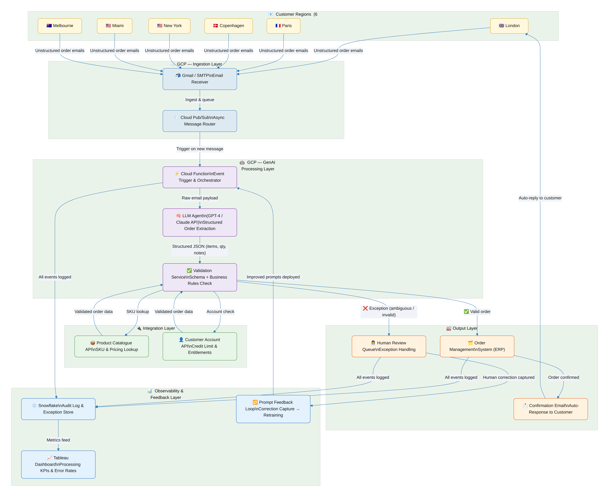
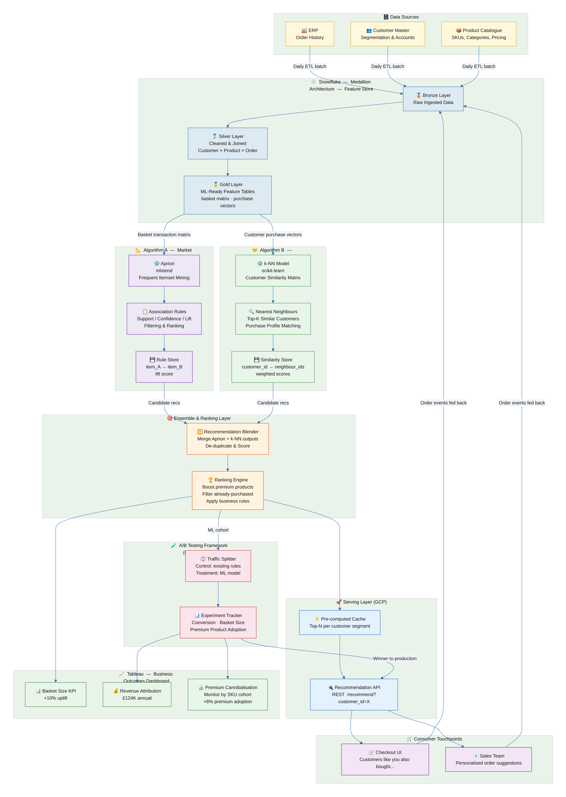
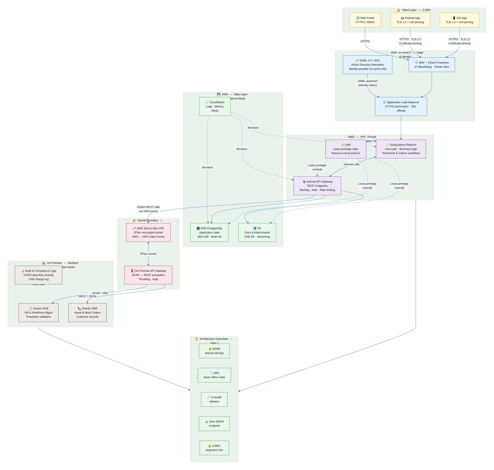
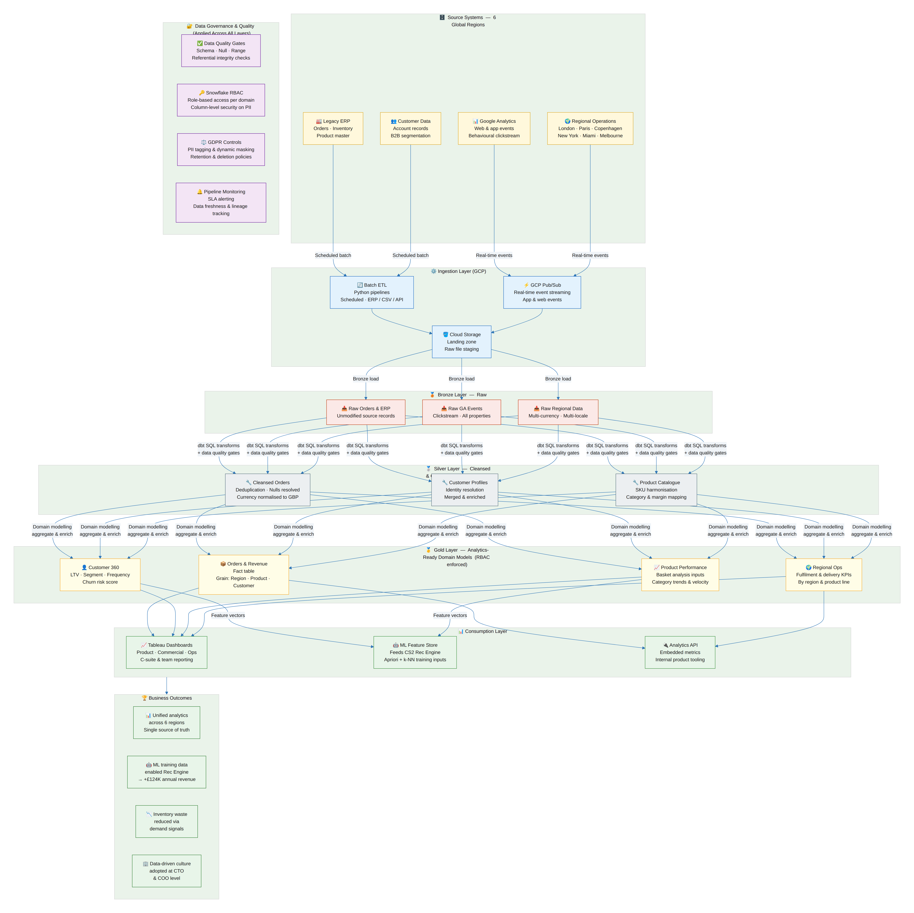
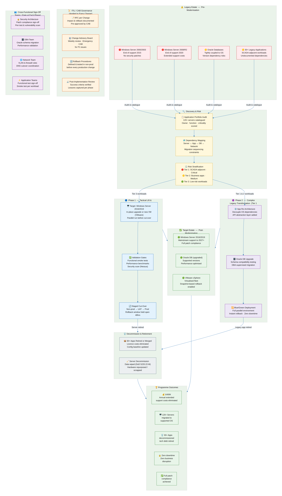

# Solutions Architecture Portfolio
### Arvind Soni — arvind_soni@hotmail.com | [LinkedIn](https://linkedin.com/in/arvindsoni) | Newcastle upon Tyne

> **20+ years** delivering cloud, data, and AI architectures across Energy & Utilities, Financial Services, and Food Distribution. This portfolio presents five architecture case studies drawn from real production systems — each with a Mermaid-as-code diagram, design decisions, trade-offs, and measurable outcomes.
>
> 🎓 **AWS Cloud Solutions Architect** — Coursera Professional Certificate (Feb 2026)
> 📋 **AWS Certified Solutions Architect – Associate (SAA-C03)** — In progress
> 📋 PMP · PMI-ACP · PSM-1 · PSPO-1

---

## Portfolio Overview

| # | Case Study | Domain | Key Patterns | Outcome |
|---|-----------|--------|-------------|---------|
| [1](#cs1) | GenAI Order Automation Pipeline | AI / Cloud | Event-driven · LLM agents · Human-in-the-loop | 90% manual effort reduction |
| [2](#cs2) | ML-Powered Recommendation Engine | ML / Data | Ensemble ML · A/B testing · Feature store | £124K additional annual revenue |
| [3](#cs3) | Hybrid Cloud Field Mobility Platform | Cloud / Security | AWS + on-premise · VPN · SAML · GDPR | £500K savings · 50% fewer office visits |
| [4](#cs4) | Enterprise Analytics & Data Platform | Data / BI | Medallion architecture · Snowflake · dbt | Unified analytics across 6 global regions |
| [5](#cs5) | Infrastructure Modernisation (CNI) | Infra / Migration | Risk-stratified migration · Blue/green · ITIL | £400K savings · Zero downtime |

> **Note on inter-case dependencies:** CS4 (Data Platform) feeds the ML Feature Store used in CS2 (Recommendation Engine). These are not standalone projects — they form a connected data and AI ecosystem, which is intentional.

---

## How to Regenerate Diagrams

All diagrams are stored as `.mmd` (Mermaid) source files — architecture as code. To regenerate any PNG:

```bash
# Install dependencies (once)
pip install playwright
playwright install chromium

# Render a diagram
python3 render_mermaid.py Case_Study1/cs1_genai_order_pipeline.mmd Case_Study1/cs1_genai_order_pipeline.png
```

To modify a diagram, edit the `.mmd` file and re-run the renderer. Changes are version-controlled alongside the architecture decisions that motivated them.

---

<a name="cs1"></a>
## Case Study 1 — GenAI Order Automation Pipeline
**Organisation:** Natoora Ltd &nbsp;|&nbsp; **Year:** 2023–2024 &nbsp;|&nbsp; **Platform:** GCP



### Business Problem
Natoora receives thousands of unstructured customer orders via email daily across 6 global regions (London, Paris, Copenhagen, New York, Miami, Melbourne). Manual processing was slow, error-prone, and unscalable as the business expanded internationally. Orders arrived in multiple languages, formats, and writing styles with no consistent structure.

### Architecture Approach
Designed an **event-driven, multi-agent GenAI pipeline**. Incoming emails trigger a GCP Cloud Function that routes messages to an LLM-based extraction agent (prompt-engineered for structured order parsing). Extracted data is validated against the product catalogue and customer account via API calls, then written to the order management system. Exceptions are flagged to a human review queue. A feedback loop captures corrections to improve prompt accuracy over time.

### Key Design Decisions & Trade-offs

| Decision | Chosen Approach | Alternative Considered | Rationale |
|----------|----------------|----------------------|-----------|
| Orchestration | GCP Cloud Functions (event-driven) | Dedicated orchestration service (Airflow) | Lower ops overhead for stateless, event-triggered workloads |
| LLM selection | Abstracted behind API layer | Hardcoded to single provider | Allows model swapping without pipeline changes |
| Exception handling | Human-in-the-loop queue | Auto-reject ambiguous orders | Zero tolerance for lost orders in B2B food distribution |
| Feedback loop | Correction capture → prompt iteration | Static prompts | Continuous improvement without retraining |

### AWS / GCP Services & Patterns
`GCP Cloud Functions` · `GCP Pub/Sub` · `Cloud Storage` · `Snowflake (audit log)` · `LLM APIs` · `REST integration`

Patterns: **Event-driven architecture** · **Human-in-the-loop** · **Prompt engineering with structured output** · **Async routing**

### Outcome
- **90% reduction** in manual order processing effort across 6 global regions
- Processing time reduced from hours to minutes per order
- Enabled international scaling without proportional headcount growth

---

<a name="cs2"></a>
## Case Study 2 — ML-Powered Recommendation Engine
**Organisation:** Natoora Ltd &nbsp;|&nbsp; **Year:** 2023 &nbsp;|&nbsp; **Platform:** GCP + Snowflake



### Business Problem
B2B customers had low awareness of Natoora's premium product range, limiting average order value. A rules-based upsell approach had failed to drive meaningful uplift. Senior leadership had concerns that an ML recommendation system might cannibalise existing premium product lines — a business risk that needed to be addressed architecturally, not just analytically.

### Architecture Approach
Designed a **two-algorithm ensemble**: Apriori association rule mining identifies frequently co-purchased products (market basket analysis), while k-Nearest Neighbours collaborative filtering surfaces recommendations based on similar customer purchase histories. A phased rollout with an **A/B testing framework** allowed incremental validation and directly addressed the cannibalisation concern before full deployment.

### Key Design Decisions & Trade-offs

| Decision | Chosen Approach | Alternative Considered | Rationale |
|----------|----------------|----------------------|-----------|
| Algorithm selection | Ensemble (Apriori + k-NN) | Single model | Apriori is item-centric; k-NN is customer-centric — coverage neither achieves alone |
| Serving | Batch pre-computation + cache | Real-time inference | B2B order patterns are stable; batch sufficient, lower cost and latency |
| Rollout strategy | A/B testing with phased expansion | Big-bang launch | Required data to disprove cannibalisation concern before full commitment |
| Feature store | Snowflake Gold layer (shared with CS4) | Separate feature DB | Reuses existing data platform investment; single source of truth |

### Services & Patterns
`Python (scikit-learn, mlxtend)` · `Snowflake` · `GCP` · `Tableau` · `REST API`

Patterns: **Batch ML training pipeline** · **Ensemble model** · **A/B testing architecture** · **API-first recommendation serving** · **Medallion feature store (from CS4)**

### Outcome
- **+10%** increase in average basket size
- **£124,000** in additional annual revenue
- Premium product lines showed **+8% adoption** in treatment cohort — cannibalisation concern disproved with data

---

<a name="cs3"></a>
## Case Study 3 — Hybrid Cloud Field Mobility Platform
**Organisation:** Northern Powergrid (via TCS) &nbsp;|&nbsp; **Year:** 2019–2020 &nbsp;|&nbsp; **Platform:** AWS (eu-west-2) + On-Premise



### Business Problem
2,000+ field engineers at a major UK Distribution Network Operator relied on paper-based timesheets and manual processes, resulting in delayed claims, high office visit volumes, and significant administrative overhead. The solution had to integrate with **legacy on-premise Oracle HCM/CRM systems** while meeting stringent utility-sector security requirements, GDPR compliance, and Architecture Review Board (ARB) approval standards.

### Architecture Approach
Designed a **hub-and-spoke hybrid cloud architecture**: AWS (eu-west-2) hosted the application tier using OutSystems low-code platform, while Oracle HCM/CRM remained on-premise behind a secure API gateway connected via IPSec Site-to-Site VPN. iOS, Android, and web front-ends communicated via TLS 1.2 with certificate pinning on mobile clients. All design decisions were documented and presented to the ARB before implementation.

### Key Design Decisions & Trade-offs

| Decision | Chosen Approach | Alternative Considered | Rationale |
|----------|----------------|----------------------|-----------|
| Oracle systems | Retain on-premise | Migrate to RDS | Regulatory constraints, licensing, and migration risk to HR systems in utility environment |
| Integration pattern | On-premise API Gateway (SOAP↔REST) | Direct Oracle exposure | Oracle never directly accessible from AWS; protocol translation at boundary |
| Mobile security | TLS 1.2 + certificate pinning | Standard HTTPS only | Prevents MITM attacks on field devices outside corporate network |
| Application platform | OutSystems (low-code) | Custom-built | 6-month delivery constraint; OutSystems provided ARB-approved enterprise controls |
| Identity | Active Directory federation (SAML 2.0) | Separate cloud identity | Reuses existing enterprise IdP; no duplicate user management |

### AWS Services & Patterns
`ALB` · `VPC (private subnets)` · `WAF` · `RDS PostgreSQL` · `S3` · `IAM` · `CloudWatch` · `Site-to-Site VPN`

Patterns: **Strangler fig (gradual legacy decoupling)** · **Hub-and-spoke API integration** · **Defence-in-depth security** · **Zero-trust mobile client**

### Outcome
- **£500,000** annual savings
- **50% reduction** in office visits within Year 1
- **2,000+ engineers** onboarded within 6-month delivery timeline
- **Zero GDPR or security incidents** post-launch
- Design approved by Architecture Review Board and Change Advisory Board

---

<a name="cs4"></a>
## Case Study 4 — Enterprise Analytics & Data Platform
**Organisation:** Natoora Ltd &nbsp;|&nbsp; **Year:** 2022–2024 &nbsp;|&nbsp; **Platform:** GCP + Snowflake + Tableau



### Business Problem
Business data was siloed across a legacy ERP, Google Analytics, and regional spreadsheets across 6 global regions (London, Paris, Copenhagen, New York, Miami, Melbourne). Leadership had no unified view of product performance, customer behaviour, or operational efficiency — hampering pricing, product, and logistics decisions. There was no consistent data model, no single source of truth, and no governance over PII.

### Architecture Approach
Designed a **cloud-native Medallion data architecture** with Snowflake as the central warehouse. Three-layer transformation pipeline (Bronze → Silver → Gold) using dbt-style SQL transforms, with data quality gates between each layer. Tableau serves as the BI layer; the Gold layer also feeds the ML Feature Store used by the Recommendation Engine (CS2), making this the data foundation for the entire analytics and ML capability.

### Key Design Decisions & Trade-offs

| Decision | Chosen Approach | Alternative Considered | Rationale |
|----------|----------------|----------------------|-----------|
| Transform pattern | ELT (load then transform) | ETL (transform then load) | Snowflake compute makes in-warehouse transformation cheaper and faster; raw data preserved |
| Bronze layer | Immutable raw vault | Overwrite with latest | Enables reprocessing from source without re-extraction; essential for DQ bug recovery |
| Transformation tooling | dbt-style SQL models | Custom Python ETL | Version-controlled, testable, lineage-tracked transformations with low overhead |
| Serving layer | Snowflake RBAC + Tableau | Separate data marts | Column-level security on PII without data duplication; single model serves all consumers |
| Ingestion | Batch (ERP/CRM) + streaming (GA/events) | Batch-only | Real-time behavioural data has different SLAs to transactional data; separate pipelines |

### Services & Patterns
`Snowflake` · `GCP Cloud Storage` · `GCP Pub/Sub` · `Python (ETL pipelines)` · `dbt patterns` · `Tableau` · `Google Analytics`

Patterns: **Medallion architecture (Bronze/Silver/Gold)** · **ELT over ETL** · **Single source of truth** · **Column-level RBAC** · **Shared feature store (feeds CS2)**

### Outcome
- **Unified analytics** across 6 global regions — single source of truth established
- **ML training data** enabled the Recommendation Engine (CS2) → **+£124K annual revenue**
- **Inventory waste reduced** via demand signals from consolidated purchase data
- **Data-driven culture** adopted at CTO and COO level

---

<a name="cs5"></a>
## Case Study 5 — Infrastructure Modernisation (Critical National Infrastructure)
**Organisation:** Northern Powergrid (via TCS) &nbsp;|&nbsp; **Year:** 2020–2022 &nbsp;|&nbsp; **Platform:** VMware vSphere + Windows Server 2016/2019



### Business Problem
Northern Powergrid operated **120+ Windows servers on end-of-life versions** (2000, 2003, 2008/R2), creating significant security exposure and extended support cost burden. 30+ legacy applications had undocumented dependencies. Any unplanned disruption to the Distribution Management System or SCADA-adjacent applications would have **national infrastructure impact** — zero tolerance for downtime was non-negotiable.

### Architecture Approach
Designed a **phased, risk-stratified migration architecture**. A dependency mapping exercise identified sequencing constraints before a single server was touched. Phase 1 tackled tactical lift-and-shift of low-risk Tier 3 workloads to prove out the process. Phase 2 addressed complex Tier 1/2 workloads requiring application re-architecture or Oracle DB upgrades, using **blue/green deployment** for zero-downtime cut-overs. Every change was controlled through ITIL CAB governance with pre-tested rollback procedures.

### Key Design Decisions & Trade-offs

| Decision | Chosen Approach | Alternative Considered | Rationale |
|----------|----------------|----------------------|-----------|
| Migration sequencing | Risk-stratified (Tier 3 → Tier 1) | Chronological / by team | Tier 3 workloads proved the process before touching SCADA-adjacent systems |
| Cut-over method | Blue/green with 48hr rollback window | In-place upgrade with snapshot | Instant rollback on critical infrastructure; no recovery time if issues found post-cutover |
| Dependency mapping | Full Server↔App↔DB↔Network graph | Best-effort per team | Undocumented dependencies were the primary risk; no migration started without this |
| App decommission | 90-day shadow period | Immediate retirement | Zero-usage confirmation before wipe; eliminated accidental dependency discovery post-decommission |
| Governance model | ITIL CAB per change | Agile-only delivery | Utility sector regulatory requirement; also essential for multi-team coordination |

### Services & Patterns
`Windows Server 2016/2019` · `VMware vSphere` · `Oracle Database` · `Nessus (security scanning)` · `ITIL change management`

Patterns: **Risk-stratified phased migration** · **Blue/green deployment** · **Dependency mapping** · **Defence-in-depth (change governance)** · **DoD 5220.22-M data sanitisation**

### Outcome
- **£400,000** annual extended support costs eliminated
- **120+ servers** migrated to supported OS versions
- **30+ legacy applications** decommissioned; technical debt retired
- **Zero business disruption** or unplanned downtime across entire programme
- **Full patch compliance** achieved; security exposure eliminated

---

## Architecture Patterns — Cross-Portfolio Reference

The following patterns appear across multiple case studies. This cross-referencing is intentional — it demonstrates consistent architectural thinking rather than one-off solutions.

| Pattern | Case Studies | Context |
|---------|-------------|---------|
| Event-driven architecture | CS1, CS4 | Pub/Sub ingestion (CS4) and order routing (CS1) |
| Human-in-the-loop | CS1, CS5 | Exception queues (CS1) and CAB governance (CS5) |
| Blue/green deployment | CS3, CS5 | Zero-downtime mobile cut-over (CS3) and server migration (CS5) |
| Risk stratification | CS3, CS5 | GDPR data classification (CS3) and migration tiers (CS5) |
| Shared feature store | CS2, CS4 | Gold layer (CS4) feeds ML training pipeline (CS2) |
| API gateway pattern | CS1, CS3 | On-premise boundary (CS3) and order validation (CS1) |
| A/B testing | CS2 | Phased ML rollout with control group |
| Medallion architecture | CS2, CS4 | Feature store (CS2) is the Gold layer of CS4 |
| Defence-in-depth | CS3, CS5 | Cert pinning + WAF + VPN (CS3); CAB + rollback (CS5) |

---

## Well-Architected Framework Mapping

| Pillar | Evidence |
|--------|---------|
| **Reliability** | Zero downtime migrations (CS5), Multi-AZ RDS (CS3), rollback procedures across all cases |
| **Security** | Certificate pinning + WAF + VPN + IAM least privilege (CS3), GDPR masking + RBAC (CS4), DoD data wipe (CS5) |
| **Performance Efficiency** | Batch pre-computation for ML serving (CS2), ELT over ETL in Snowflake (CS4), blue/green cut-overs (CS3, CS5) |
| **Cost Optimisation** | £400K support cost elimination (CS5), £500K process savings (CS3), £124K revenue via ML (CS2) |
| **Operational Excellence** | CloudWatch monitoring (CS3), pipeline SLA alerting (CS4), ITIL CAB governance (CS5), PIR per phase |
| **Sustainability** | 30+ app decommissions reducing compute footprint (CS5), server consolidation via VMware (CS5) |

---

## Certifications & Technical Profile

```
Cloud:        AWS Cloud Solutions Architect – Coursera Professional Certificate (Feb 2026)
              AWS SAA-C03 – In progress
              Courses: AWS Technical Essentials · Architecting on AWS · Building Data Lakes · Exam Prep

Delivery:     PMP · PMI-ACP · PSM-1 · PSPO-1

AI/ML:        IBM Generative AI for Project Managers

Stack:        Python · SQL · GCP · AWS · Snowflake · Tableau · Terraform · Docker
              GitHub Actions (CI/CD) · OutSystems · Oracle · Mermaid (architecture-as-code)
```

---

*All diagrams are generated from `.mmd` source files using `render_mermaid.py`. Architecture as code — version controlled, diffable, and maintainable.*
